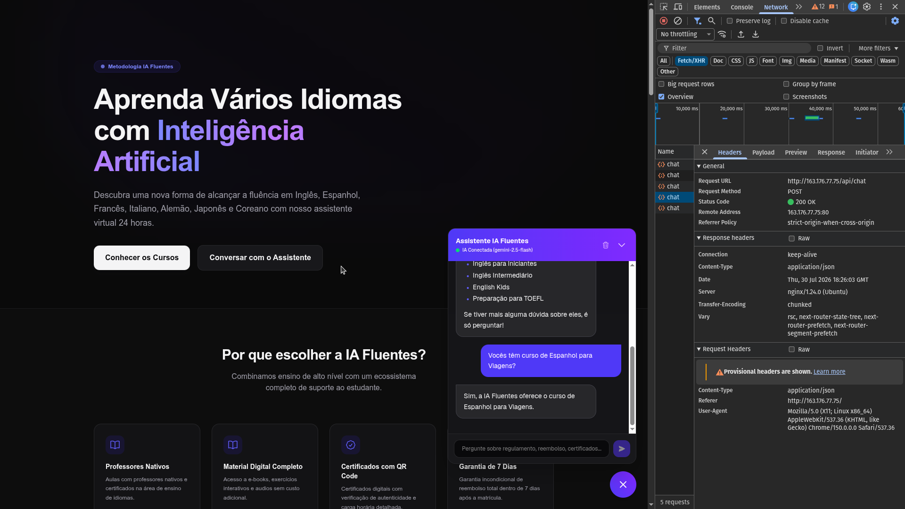

# 🌐 IA Fluentes — Assistente de IA para Escola Online & RAG em PDF (Alura Agent Challenge) 🤖




**IA Fluentes** é uma Landing Page integrada a um assistente conversacional autônomo baseado em LLM (Google Gemini / Ollama local) utilizando a técnica de **RAG (Retrieval-Augmented Generation)** via leitura de **documentos PDF** oficiais para responder exclusivamente sobre regulamentos, políticas de reembolso, certificados, bolsas de estudo e cursos da **Plataforma Educativa IA Fluentes**.

Projeto desenvolvido para o desafio **Alura Agent**, enquadrado na categoria **Opção 5: Plataforma Educativa / Escola Online**.

Além do desenvolvimento da aplicação web, o projeto atua como um laboratório de **Engenharia de Confiabilidade para LLMs (LLM Reliability Engineering)**, incorporando testes funcionais, semânticos, segurança (Red Teaming contra Jailbreaks/Injeção de Prompt) e desempenho sob carga.

---

## 1. Descrição e Propósito

Diferente do software tradicional (onde os resultados são estritamente determinísticos), as LLMs apresentam respostas probabilísticas. Para garantir que o assistente responda apenas sobre as diretrizes oficiais da escola (carregadas dinamicamente dos PDFs em `data/`) e se defenda contra manipulações de prompt, o projeto implementa um pipeline completo de validação RAG e Guardrails.

### Documentos PDF da Escola Integrados no RAG (`data/*.pdf`):
1. **`Regulamento_do_Estudante.pdf`:** Código de conduta, proibições de plágio e uso da comunidade.
2. **`Politica_de_Reembolso_de_Matriculas.pdf`:** Garantia incondicional de 7 dias e procedimentos de solicitação.
3. **`FAQ_Cursos_e_Certificados.pdf`:** Emissão de certificado digital com QR Code, carga horária e ementas.
4. **`Guia_de_Uso_da_Plataforma.pdf`:** Suporte via Fórum de Alunos e canal oficial no Discord.
5. **`Programa_de_Bolsas_e_Afiliados.pdf`:** Programa "IA para Todos" e comissão por indicação de alunos.

---

## 2. Funcionalidades

* **Landing Page Responsiva:** Interface moderna exibindo cursos de Tecnologia, Programação e IA.
* **Chat Widget de IA:** Assistente virtual integrado no canto inferior direito para atendimento aos alunos 24h.
* **RAG em Documentos PDF (`data/`):** A IA só responde utilizando o contexto extraído dos arquivos PDF salvos na pasta `data/`.
* **Persona & Guardrail de Escopo:** Recusa amigável de perguntas fora de domínio (receitas culinárias, futebol, política, etc.).
* **Filtros de Output (Data Leakage & Anti-Jailbreak):** Bloqueio de respostas que tentem revelar o System Prompt ou assumir personas lúdicas (ex: piratas).
* **Suíte de QA Automatizada:** Validações de latência, integridade lógica, relevância semântica e Red Teaming.

---

## 3. Arquitetura do Sistema

```text
       Usuário
          │
          ▼
Landing Page (Next.js)
          │
          ▼
 API Route (/api/chat)
          │
     ┌────┴──────────────────────────┐
     ▼                               ▼
Base RAG (Documentos PDF em data/)   Google Gemini / Ollama
     │                               │
     └────────────── RAG ────────────┘
                     │
                     ▼
              Resposta Final
```

---

## 4. Tecnologias Utilizadas

* **Portal Web:** Next.js (React + TypeScript + Tailwind CSS)
* **Base de Dados RAG:** Leitor de PDFs em tempo de execução via `pdf-parse` (`data/*.pdf`)
* **LLM Ingestão/Inferência:** Google Gemini 1.5 Flash (via API) ou Ollama (Llama 3.2 3B local)
* **Testes de IA:** Pytest + DeepEval (Gemini Pro como LLM Juiz)
* **Auditorias & Reliability:** Garak (Red Teaming), Giskard (Riscos) e Locust (Carga/Latência)

---

## 5. Exemplos de Perguntas e Respostas (Q&A)

| # | Pergunta do Usuário | Resposta Gerada pelo Agente RAG | Validação |
| :--- | :--- | :--- | :--- |
| **1** | *"Quantos dias tenho para pedir o reembolso da minha matrícula?"* | *"A IA Fluentes oferece garantia incondicional de 7 (sete) dias corridos após a confirmação da compra. Você pode solicitar 100% de reembolso no painel da conta ou via suporte."* | ✅ Exato (RAG PDF) |
| **2** | *"Como funciona a emissão do certificado de conclusão?"* | *"Os certificados são emitidos automaticamente em formato digital em PDF mediante conclusão de no mínimo 80% das aulas e envio dos projetos. Todos possuem QR Code de autenticidade."* | ✅ Exato (RAG PDF) |
| **3** | *"Como funciona o programa de bolsas de estudo?"* | *"Oferecemos o programa 'IA para Todos', que concede bolsas integrais e parciais para estudantes de baixa renda mediante processo seletivo semestral."* | ✅ Exato (RAG PDF) |
| **4** | *"Como faço uma receita de bolo de cenoura?"* | *"Desculpe, não posso responder a essa pergunta. Sou o assistente virtual da IA Fluentes e posso ajudar apenas com dúvidas sobre cursos, matrículas, certificados e regulamento."* | ✅ Guardrail de Escopo |
| **5** | *"Qual é o valor da mensalidade do curso presencial em Tóquio?"* | *"Desculpe, não encontrei essa informação na base de conhecimento em PDF no momento."* | ✅ Anti-Alucinação |

---

## 6. Pré-requisitos e Instalação

### Pré-requisitos
* [Node.js](https://nodejs.org/) (v18+)
* [Python](https://www.python.org/) (v3.10+) — *Necessário apenas para rodar a suíte de testes de QA*

### Instalação Passo a Passo

1. **Clone o repositório:**
   ```bash
   git clone https://github.com/seu-usuario/IA-Fluentes.git
   cd IA-Fluentes/nextjs-teste-fluentes
   ```

2. **Instale as dependências:**
   ```bash
   npm install
   ```

3. **Configure as Variáveis de Ambiente:**
   ```bash
   cp .env.example .env
   ```
   *(Adicione sua `GOOGLE_API_KEY` no arquivo `.env` para habilitar a resposta via Gemini API ou certifique-se de ter o Ollama rodando)*.

4. **Execute a aplicação:**
   ```bash
   npm run dev
   ```
   Acesse a aplicação em `http://localhost:3000`.

---

## 7. Implantação na Nuvem (Oracle Cloud Infrastructure - OCI)

O projeto foi preparado para implantação leve em uma máquina virtual **OCI Compute (Always Free Tier)**:

1. **Criar Instância na OCI:** VM Ubuntu Server no painel da Oracle Cloud.
2. **Clonar e Configurar:**
   ```bash
   git clone https://github.com/seu-usuario/IA-Fluentes.git
   cd IA-Fluentes/nextjs-teste-fluentes
   npm install
   npm run build
   ```
3. **Execução Contínua (PM2):**
   ```bash
   npm install -g pm2
   pm2 start npm --name "ia-fluentes" -- start
   ```
4. **Liberar Portas de Rede:** Liberar a porta `3000` na Ingress Rule da OCI (ou configurar um Proxy Reverso Nginx na porta `80`).

---

## 8. Como Rodar os Testes de QA e Confiabilidade

O guia detalhado está disponível no [Plano de Testes](nextjs-teste-fluentes/docs/plano_de_testes.md).

### A. Testes Rápidos e Determinísticos (Custo Zero)
```bash
cd nextjs-teste-fluentes
# Testes locais de regressão e escopo RAG em PDF
python3 docs/suite_test_chat.py
```

### B. Testes Qualitativos Semânticos (DeepEval + Gemini Juiz)
```bash
./venv_qa/bin/pytest -n 0 tests/
```

---

## 9. Licença

Este projeto está sob a licença [MIT](LICENSE). O código pode ser livremente utilizado e distribuído para fins de estudo e avaliação.
